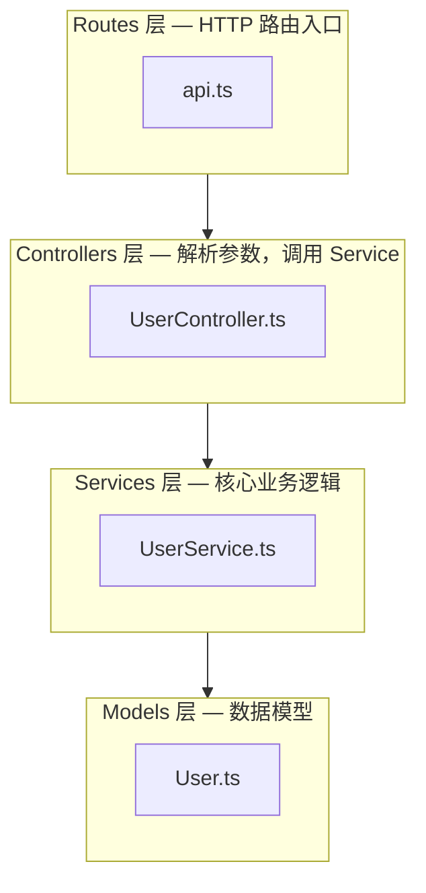

# Agent 2 — 架构分析师 (Architecture Mapper)

> 归属：`code-explore` skill，Phase 1 并行分析之一。

## 任务

识别项目整体架构和目录职责。

⚠️ **只用 Glob 获取文件树（路径列表），不读取源码文件内容。README 最多读前 150 行。**

## 步骤

### 步骤 0：代码量基线（工具增强，可选）

检查 scc 是否可用：

```bash
[ -x "{SKILL_DIR}/bin/scc" ] && echo "AVAILABLE" || echo "MISSING"
```

- **MISSING** → 跳过此步骤，继续步骤 1 的纯 Glob 模式。
- **AVAILABLE** → 继续以下操作（在步骤 1 之后执行，待 Glob 返回一级目录列表）：

  对步骤 1 发现的每个一级子目录，运行：

  ```bash
  "{SKILL_DIR}/bin/scc" --no-cocomo -f json "{TARGET}/{dir}" 2>/dev/null
  ```

  JSON 返回一个数组，每个元素含 `Code` 字段（该语言在此目录下的纯代码行数，不含空行和注释）。将所有元素的 `Code` 字段求和，得到该目录的 **真实代码行数**。

  汇总为 **DIR_LOC_MAP**（格式：`目录名 → N lines`），在后续 Mermaid 图节点标注：
  - `> 10k lines` → 标注 `(Xk lines)`，这是核心业务目录，优先画节点
  - `1k–10k lines` → 标注 `(Xk lines)`
  - `< 1k lines` → 不标注，次要目录可合并

### 步骤 1：Glob 目录结构

用 Glob 获取完整目录结构（**只拿路径，不读内容**）：

```
Glob pattern="*"           # 顶层目录
Glob pattern="*/*"         # 第二层
Glob pattern="*/*/*"       # 第三层（通常足够推断架构）
```

不要使用 `**/*`（会返回所有文件，过于庞大）。

获得一级目录列表后，**立即执行步骤 0 中的 scc 代码量分析**（如果 scc 可用）。

### 步骤 2：识别 index/barrel 文件，提取真实模块依赖

   按以下优先级查找 index 文件，取满 **5 个**为止：
   - 根目录下的 `index.*`
   - `src/` 下的 `index.*`
   - 各一级子目录下的 `index.*`（如 `src/routes/index.*`、`src/services/index.*`）

   对每个找到的 index 文件，用 Grep 提取 import 行：
   ```
   Grep pattern="^import" 前 30 行
   Grep pattern="^from"   前 30 行  （Python 风格）
   Grep pattern="require(" 前 30 行 （CommonJS 风格）
   ```
   从中提取 `from "..."` 或 `require("...")` 的路径，推断模块间真实依赖关系。

### 步骤 3：识别架构模式

- **MVC**: `models/` + `views/` + `controllers/`
- **Clean Architecture**: `domain/` + `application/` + `infrastructure/` + `interfaces/`
- **Feature-based**: 按功能模块组织（`auth/` + `user/` + `payment/`）
- **Monorepo**: `packages/` 或 `apps/` 下有多个子项目
- **Layered**: `api/` + `service/` + `repository/` + `model/`
- **Microservices**: 多个独立服务目录

### 步骤 4：Monorepo 检测

如果顶层目录中存在 `packages/`、`apps/`、`services/` 且各自包含多个子目录，判断为 monorepo。此时**暂停分析**，向用户询问：

```
⚠️  检测到这是一个 Monorepo，包含以下子包：
- packages/ui
- packages/core
- apps/web
- apps/api
你想重点分析哪个？（输入路径，或输入 all 分析整体架构）
```

根据用户选择，将后续所有 Agent 的分析范围限定在该子目录。

### 步骤 5：读取 README

阅读 README.md（如存在）提取架构描述，最多读前 150 行。

### 步骤 6：检查文档目录

检查 `docs/` 或 `documentation/` 目录。

## 输出格式

```
## 架构设计
- 架构模式: [MVC / Clean Arch / Feature-based / Monorepo / ...]
- 项目类型: [Web API / 前端 SPA / CLI 工具 / 库/SDK / 全栈应用 / ...]

### 模块依赖图

> 注：依赖关系基于 index 文件 import 推断，不代表完整调用图



**节点规则**：
- 同目录下文件 ≤ 3 个：每个文件单独作为节点，节点名 = 文件名（不含扩展名）
- 同目录下文件 > 3 个：合并为一个 subgraph，subgraph 名 = 目录名
- 总节点数上限 15 个；超出时只保留顶层目录级别的 subgraph
- 每个节点/subgraph 的标签格式：`名称 — 一句话职责`
- Mermaid 兼容性规则：**所有节点标签必须使用引号**（如 `A["label"]`），
  标签包含 `/`、`*`、`:`、`.`、空格或中文标点时，禁止使用 `A[label]` 裸写法

### 核心模块
| 模块 | 路径 | 职责 |
|------|------|------|
| 认证 | src/auth/ | 用户登录、JWT 管理 |
| ... | ... | ... |
```

## 完成

输出：
```
✅ Agent 2/5 完成 — 架构图已生成
```
