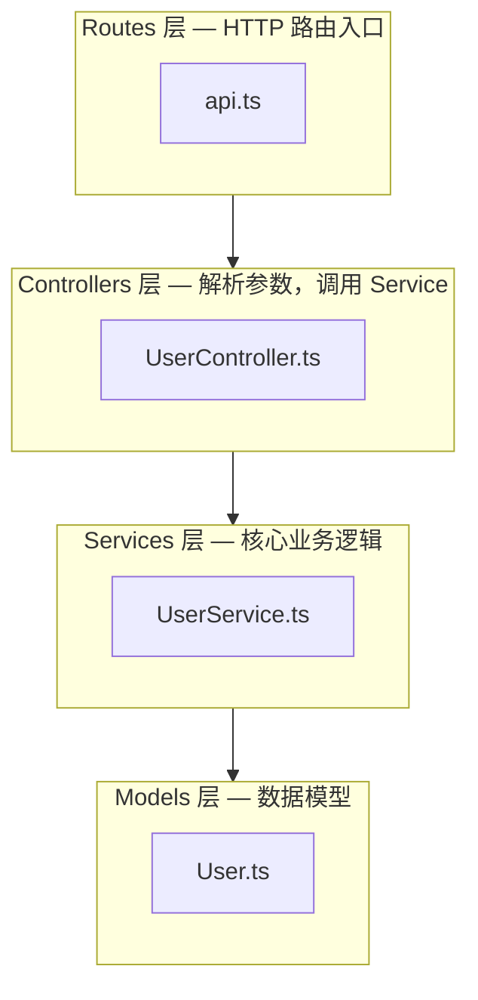
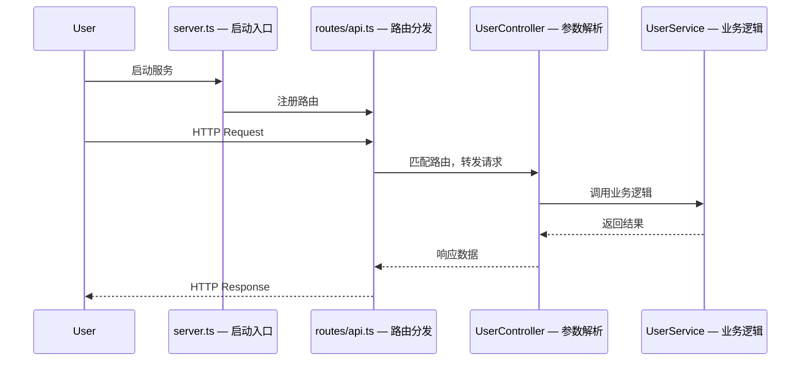

# Understand Repo — GitHub 项目理解向导

帮助普通技术人快速建立对陌生代码库的完整心智模型。

## 核心理念

普通技术人 clone 一个项目时，最大的困境不是看不懂代码，而是**不知道从哪开始看**。
这个 skill 的目标是：30 分钟内让你对一个陌生项目建立足够的全局认知。

## 调用方式

```
/understand-repo <项目路径>
/understand-repo /path/to/cloned/project
/understand-repo .   (当前目录)
```

---

## Token 使用原则

> **核心策略：用结构推断意图，而不是读源码找答案。**
>
> ⚠️ **作用域**：以下规则**仅适用于 Phase 1**（初始分析阶段）。
> Phase 3 导览模式中可以读取源码文件，但遵循"每步 1 文件、最多 150 行"的独立约束。

**Phase 1 的所有 Agent 必须严格遵守以下规则：**

1. **Glob 优先于 Read**：获取目录结构时只用 Glob 拿文件路径列表，不读文件内容
2. **Grep 优先于 Read**：需要找特定信息时用 Grep 定向搜索，而不是把整个文件读进来
3. **限制读取行数**：
   - 配置文件（`package.json`, `go.mod` 等）：最多读前 **80 行**
   - README.md：最多读前 **150 行**
   - 入口/源码文件：最多读前 **60 行**
   - `.env.example`：最多读前 **50 行**
4. **禁止读取的文件类型**：
   - 业务逻辑实现文件（`services/`, `controllers/` 内的 `.ts/.js/.py/.go` 等）
   - 测试文件（`*.test.*`, `*.spec.*`, `*_test.go`）
   - 生成文件（`dist/`, `build/`, `.next/`, `node_modules/`）
   - 大型静态资源（图片、字体、二进制文件）
5. **每个 Agent 读取文件数上限：10 个**

---

## 执行流程

### Phase 0：确认目标 & 检查历史状态

1. **输入验证**（路径异常时立即停止并提示，不继续执行）：

   - **路径为空** → 提示：
     ```
     ❌ 请提供项目路径，例如：
        /understand-repo .              （当前目录）
        /understand-repo ~/projects/my-repo
     ```
   - **路径不存在** → 提示：
     ```
     ❌ 路径 `{path}` 不存在，请检查路径是否正确。
     ```
   - **路径是文件而非目录** → 提示：
     ```
     ❌ `{path}` 是一个文件，请提供项目根目录路径。
     ```

2. **检查是否存在 `.repo-context/PROGRESS.md`**（之前会话留下的状态）：

   **如果不存在** → 直接进入 Phase 1 全量分析

   **如果存在** → 执行 **代码变更检测**：

   首先判断被分析项目是否为 git 仓库：

   ```bash
   git rev-parse HEAD 2>/dev/null
   ```

   根据结果走不同分支：

   **分支 A：是 git 仓库** → 比较 commit hash：

   - hash 与 `PROGRESS.md` 中 `analyzed_at_commit` 相同 → 直接恢复
   - hash 不同 → 执行 diff 分析：
     ```bash
     git diff --stat {stored_commit}..HEAD
     ```
     交叉比对变更文件 vs `KNOWLEDGE.md` 已探索文件：

     | 类别 | 处理方式 |
     |------|---------|
     | **已探索 & 已变更** | 标记为 ⚠️ STALE，下次访问时重读 diff |
     | **未探索 & 已变更** | 仅记录，不影响现有理解 |
     | **配置文件变更** | 触发对应 Agent 局部重分析 |

   **分支 B：非 git 仓库**（zip 解压、无版本控制）→ 用时间戳判断：

   - 比较 `PROGRESS.md` 中的 `analyzed_at` 时间戳 vs 项目文件的最新修改时间：
     ```bash
     find . -newer .repo-context/PROGRESS.md -type f \
       ! -path './.repo-context/*' ! -path './node_modules/*' \
       ! -path './.git/*' | head -20
     ```
   - 如有文件比上次分析时间更新 → 提示用户："检测到文件有变动（非 git 项目，无法精确 diff）"
   - 提供两个选项：`[R] 直接恢复` 或 `[S] 全量重新分析`
   - 注意：非 git 项目**不提供** `[U] 局部更新`选项（没有 diff 信息）

   **变更摘要展示（git 仓库）：**

   ```
   📂 发现上次的学习记录 + 检测到代码更新

   上次分析: 2026-03-14 16:32（commit a3f7c21）
   当前版本: commit d9e2b84（3天前，共 23 个文件变更）

   对你已理解内容的影响：
   ⚠️  src/controllers/UserController.ts — 已变更（你上次探索过）
   ⚠️  src/services/UserService.ts — 已变更（你上次探索过）
   ✅  src/routes/api.ts — 未变更（你的理解仍然有效）
   📦  package.json — 已变更（依赖有更新）

   建议操作：
   [U] 局部更新：只重新分析 2 个变更文件 + 依赖（推荐）
   [R] 直接恢复：忽略变更，从上次位置继续（风险：部分理解可能过期）
   [S] 全量重新分析（代价最高，适合大版本升级）
   ```

   **选择 [U] 局部更新时的执行逻辑：**

   - 对每个 `⚠️ STALE` 文件：用 `git diff {stored_commit}..HEAD -- {文件路径}` 读取 diff（不读整文件），理解"改了什么"，更新 `KNOWLEDGE.md` 对应条目
   - 若 `package.json` 变更：单独重跑 Agent 4（依赖分析），更新 `KNOWLEDGE.md` 的依赖部分
   - 若目录结构有新增/删除：更新 `PROGRESS.md` 的路径规划
   - **不重跑**未变更维度的 Agent

   > **核心原则**：用 `git diff` 而不是重读整个文件。一个 200 行文件的 diff 通常只有 20-30 行，
   > 成本降低 10 倍，且能精确表达"变化了什么"。

3. 告诉用户当前状态后，继续后续流程

### Phase 1：并行 5 Agent 分析

**同时启动以下 5 个 Explore 子 Agent，全部并行执行：**

---

#### Agent 1 — 技术栈探测器 (Stack Detector)

**任务**：识别项目使用的语言、框架、运行时。

⚠️ **只读配置/清单文件，不读源码。每个文件最多读 80 行。**

检查以下文件（按优先级）：
- `package.json` → Node.js/前端项目
- `go.mod` / `go.sum` → Go 项目
- `requirements.txt` / `pyproject.toml` / `setup.py` / `Pipfile` → Python 项目
- `Cargo.toml` → Rust 项目
- `pom.xml` / `build.gradle` / `build.gradle.kts` → Java/Kotlin 项目
- `composer.json` → PHP 项目
- `Gemfile` → Ruby 项目
- `*.csproj` / `*.sln` → .NET 项目
- `mix.exs` → Elixir 项目

从 `package.json` 中提取：
- `dependencies` 中的框架（React/Vue/Angular/Express/Next.js/Nest.js 等）
- `devDependencies` 中的工具链
- `scripts` 字段了解项目命令

**输出格式**：
```
## 技术栈
- 主语言: [语言 + 版本]
- 框架: [框架名 + 版本]
- 运行时: [Node 18 / Python 3.11 / Go 1.21 等]
- 包管理器: [npm/yarn/pnpm/pip/go modules 等]
- 构建工具: [webpack/vite/esbuild/make 等]
- 测试框架: [jest/pytest/go test 等]
- 类型系统: [TypeScript/mypy/强类型/动态类型]
```

---

#### Agent 2 — 架构分析师 (Architecture Mapper)

**任务**：识别项目整体架构和目录职责。

⚠️ **只用 Glob 获取文件树（路径列表），不读取源码文件内容。README 最多读前 150 行。**

步骤：
1. 用 Glob 获取完整目录结构（**只拿路径，不读内容**）：
   ```
   Glob pattern="*"           # 顶层目录
   Glob pattern="*/*"         # 第二层
   Glob pattern="*/*/*"       # 第三层（通常足够推断架构）
   ```
   不要使用 `**/*`（会返回所有文件，过于庞大）

2. **识别 index/barrel 文件，提取真实模块依赖**（新增步骤）：

   按以下优先级查找 index 文件，取满 **5 个**为止：
   - 根目录下的 `index.*`
   - `src/` 下的 `index.*`
   - 各一级子目录下的 `index.*`（如 `src/routes/index.*`、`src/services/index.*`）

   对每个找到的 index 文件，用 Grep 提取 import 行：
   ```
   Grep pattern="^import" 前 30 行
   Grep pattern="^from"   前 30 行  （Python 风格）
   Grep pattern="require(" 前 30 行 （CommonJS 风格）
   ```
   从中提取 `from "..."` 或 `require("...")` 的路径，推断模块间真实依赖关系。

3. 识别架构模式：
   - **MVC**: `models/` + `views/` + `controllers/`
   - **Clean Architecture**: `domain/` + `application/` + `infrastructure/` + `interfaces/`
   - **Feature-based**: 按功能模块组织（`auth/` + `user/` + `payment/`）
   - **Monorepo**: `packages/` 或 `apps/` 下有多个子项目
   - **Layered**: `api/` + `service/` + `repository/` + `model/`
   - **Microservices**: 多个独立服务目录
3. **Monorepo 检测**：如果顶层目录中存在 `packages/`、`apps/`、`services/` 且各自包含多个子目录，判断为 monorepo。
   此时**暂停分析**，向用户询问：
   ```
   ⚠️  检测到这是一个 Monorepo，包含以下子包：
   - packages/ui
   - packages/core
   - apps/web
   - apps/api
   你想重点分析哪个？（输入路径，或输入 all 分析整体架构）
   ```
   根据用户选择，将后续所有 Agent 的分析范围限定在该子目录。
4. 阅读 README.md（如存在）提取架构描述，最多读前 150 行
5. 检查 `docs/` 或 `documentation/` 目录

**输出格式**：
```
## 架构设计
- 架构模式: [MVC / Clean Arch / Feature-based / Monorepo / ...]
- 项目类型: [Web API / 前端 SPA / CLI 工具 / 库/SDK / 全栈应用 / ...]

### 模块依赖图

> 注：依赖关系基于 index 文件 import 推断，不代表完整调用图



**节点规则**：
- 同目录下文件 ≤ 3 个：每个文件单独作为节点，节点名 = 文件名（不含扩展名）
- 同目录下文件 > 3 个：合并为一个 subgraph，subgraph 名 = 目录名
- 总节点数上限 15 个；超出时只保留顶层目录级别的 subgraph
- 每个节点/subgraph 的标签格式：`名称 — 一句话职责`

### 核心模块
| 模块 | 路径 | 职责 |
|------|------|------|
| 认证 | src/auth/ | 用户登录、JWT 管理 |
| ... | ... | ... |
```

---

#### Agent 3 — 入口追踪者 (Entry Point Tracer)

**任务**：找到程序的启动入口和核心执行流程。

⚠️ **先用 Grep 搜索关键词定位文件，再读文件前 60 行。最多读 5 个文件。**

寻找入口文件（按语言）：
- **Node.js**: `index.js/ts`, `server.js/ts`, `app.js/ts`, `main.js/ts`, `package.json` 的 `main`/`bin` 字段
- **Next.js/React**: `app/page.tsx`, `pages/index.tsx`, `src/App.tsx`
- **Go**: `main.go`, `cmd/*/main.go`
- **Python**: `main.py`, `app.py`, `manage.py` (Django), `run.py`, `__main__.py`
- **Java**: 包含 `public static void main` 的文件，`Application.java` (Spring Boot)
- **Rust**: `src/main.rs`, `src/lib.rs`

步骤：
1. 用 Glob 找候选入口文件（`**/main.*`, `**/index.*`, `**/app.*`, `**/server.*`）
2. 用 Grep 搜索启动关键词：`"listen\|app.run\|serve\|bootstrap\|StartServer"` 快速定位真正的入口
3. 读入口文件前 **60 行**（只看初始化部分）
4. 用 Grep 搜索 `import|require` 识别被频繁引用的核心模块（**不要读这些模块**，只记录路径）
5. **不要递归追踪调用链**——只记录"核心业务逻辑在哪个目录"即可

**输出格式**：
```
## 程序入口与核心流程

### 启动入口
- 文件: `src/server.ts:1`
- 启动顺序: 加载环境变量 → 初始化数据库 → 注册路由 → 监听端口

### 请求流程图

> 注：时序图仅覆盖入口到第一层调用，不代表完整请求链路



**fallback**：若入口文件无明显调用链（如纯库项目、CLI 工具），跳过时序图，改用文字描述执行流程。

### 最重要的文件（建议优先阅读）
1. `src/server.ts` — 应用入口，了解整体初始化
2. `src/routes/index.ts` — 所有 API 路由一览
3. `src/services/` — 核心业务逻辑所在
```

---

#### Agent 4 — 依赖分析师 (Dependency Analyst)

**任务**：分析关键依赖库，解释"为什么用这个库"。

⚠️ **只读依赖声明文件，最多读 80 行。不要读任何源码文件。**

步骤：
1. 读取依赖声明文件（`package.json` 前 80 行、`requirements.txt` 前 80 行 等）
2. 将依赖分类：核心框架 / 数据库 / 认证 / HTTP / 工具 / 测试 / 构建
3. 对非显而易见的库解释其用途（基于库名 + 已知知识推断，**不需要去读库的源码**）
4. 识别项目的技术选型风格（保守/前沿/重量级/轻量级）

常见库识别表（示例）：
- `prisma` / `typeorm` / `drizzle` → 数据库 ORM
- `zod` / `joi` / `yup` → 数据校验
- `bullmq` / `bee-queue` → 任务队列
- `socket.io` → 实时通信
- `stripe` → 支付
- `openai` / `anthropic` → AI/LLM 接入
- `redis` / `ioredis` → 缓存
- `winston` / `pino` → 日志

**输出格式**：
```
## 关键依赖解析

### 核心框架
- `express@4.18` — Web 框架，处理 HTTP 路由
- `prisma@5.x` — 数据库 ORM，类型安全的数据库访问

### 业务相关
- `stripe@14` — 支付处理（说明项目有付费功能）
- `openai@4` — 调用 GPT API（说明项目有 AI 功能）

### 工具库
- `zod` — 运行时类型校验，用于 API 入参验证
- `dayjs` — 时间处理（比 moment.js 更轻量）

### 技术选型风格
[保守稳定 / 激进前沿 / 轻量极简 / 重型企业级]
原因: ...
```

---

#### Agent 5 — 开发环境向导 (Dev Setup Guide)

**任务**：提取本地运行所需的全部信息。

⚠️ **每个文件限读指定行数，重点提取命令和变量名，不需要读完整文件。**

检查以下文件（**按顺序，找到足够信息即停止**）：
- `README.md` — 前 **150 行**，用 Grep 搜索 `"install\|setup\|getting started\|run\|start\|require\|gpu\|cuda\|hardware"` 定位相关章节
- `.env.example` / `.env.sample` — 前 **50 行**，只提取变量名和注释
- `package.json` scripts 字段 — 用 Grep 搜索 `"scripts"` 附近 **30 行**
- `Makefile` — 前 **40 行**（通常 target 都在前面）
- `docker-compose.yml` — 前 **60 行**
- `.github/workflows/*.yml` — 只看 **1 个** CI 文件的前 **40 行**
- `requirements.txt` / `pyproject.toml` — 用 Grep 搜索 `"torch\|tensorflow\|cuda\|gpu\|nvidia\|jax\|triton"` 判断是否有 GPU 依赖

**硬件需求识别规则**（检测到以下信号时，必须在输出中标注）：

| 信号 | 意味着 |
|------|--------|
| 依赖中含 `torch`, `tensorflow`, `jax`, `triton` | 可能需要 GPU（推理/训练量决定严重程度）|
| README 中出现 `CUDA`, `GPU`, `VRAM`, `A100`, `H100`, `RTX` | 明确 GPU 要求 |
| `docker-compose.yml` 中含 `deploy.resources.reservations.devices` | Docker GPU 直通 |
| 依赖中含 `onnxruntime-gpu`, `cupy`, `faiss-gpu` | GPU 专属版本 |
| `.env.example` 含 `MODEL_PATH`, `WEIGHTS_PATH`, `CHECKPOINT` | 需要下载大模型权重 |
| README 中出现 `vLLM`, `TensorRT`, `DeepSpeed`, `NCCL` | 推理/训练框架，通常需要高端 GPU |

**输出格式**：
```
## 本地开发指南

### ⚡ 本地可运行性评估

> 说明：这个部分解释"能不能在普通开发机上跑起来"，以及"和生产部署的差距在哪"。

**本地可运行等级**：[从以下选一个]

🟢 **完全可本地运行** — 无特殊硬件要求，按快速启动步骤即可
🟡 **部分可本地运行** — 核心功能可跑，但以下能力受限：
   - [例：向量检索需要 GPU 才能有合理速度，本地 CPU 运行会极慢]
   - [例：模型推理在本地只能用 CPU 版本，结果相同但速度慢 10-50x]
🔴 **本地运行受限** — 强依赖以下硬件/服务，普通开发机无法完整运行：
   - [例：训练脚本需要 NVIDIA GPU（至少 16GB VRAM），CPU 不支持]
   - [例：推理服务依赖 CUDA，无 GPU 则无法启动]

**生产部署 vs 本地开发 的差距**：

| 维度 | 生产要求 | 本地替代方案 |
|------|---------|------------|
| GPU | [例：A100 80GB] | [例：可用 CPU 跑小模型，或用 API 替代] |
| 内存 | [例：256GB RAM] | [例：减小 batch size 可在 16GB 运行] |
| 存储 | [例：2TB 模型权重] | [例：可下载量化版本（约 4GB）] |
| 外部服务 | [例：需要 AWS S3 / Pinecone] | [例：可用本地 MinIO / Chroma 替代] |

> 如果没有 GPU 硬件，建议的替代方案：
> - [例：使用 OpenAI API / Anthropic API 替代本地推理]
> - [例：使用 Hugging Face Inference Endpoints]
> - [例：Google Colab / Kaggle Notebooks（免费 GPU）]
> - [例：仅运行数据处理/评估部分，跳过训练]

---

### 前置要求
- Node.js >= 18
- PostgreSQL 14+
- Redis (可选，用于缓存)

### 快速启动
```bash
# 1. 安装依赖
npm install

# 2. 配置环境变量
cp .env.example .env
# 编辑 .env，填入以下必填项：
# DATABASE_URL=postgresql://...
# JWT_SECRET=your-secret

# 3. 初始化数据库
npm run db:migrate

# 4. 启动开发服务器
npm run dev
```

### 常用命令
| 命令 | 用途 |
|------|------|
| `npm run dev` | 启动开发服务器（热重载） |
| `npm run test` | 运行测试 |
| `npm run build` | 生产构建 |
| `npm run lint` | 代码检查 |

### 环境变量说明
| 变量 | 必填 | 说明 |
|------|------|------|
| `DATABASE_URL` | ✅ | PostgreSQL 连接字符串 |
| `JWT_SECRET` | ✅ | JWT 签名密钥 |
| `REDIS_URL` | ❌ | Redis 地址，默认 localhost:6379 |
```

---

### Phase 2：综合输出

收集所有 5 个 Agent 的结果后，生成完整的 `UNDERSTANDING.md`：

```markdown
# [项目名] — 项目理解指南

> 生成时间: [date] | 分析工具: understand-repo skill

## TL;DR（30秒了解）
[2-3 句话：这是什么项目，解决什么问题，核心价值是什么]

## 技术栈一览
[来自 Agent 1]

## 架构设计
[来自 Agent 2]

## 程序入口与核心流程
[来自 Agent 3]

## 关键依赖解析
[来自 Agent 4]

## 本地开发指南
[来自 Agent 5]

> 包含"本地可运行性评估"小节，说明是否需要 GPU/特殊硬件，以及生产部署要求与本地开发环境的差距。

## 建议学习路径

对于想深入理解这个项目的开发者，建议按以下顺序阅读：

### 第一步：建立全局认知（30分钟）
1. 阅读 `README.md` 了解项目背景
2. 看 `[入口文件]` 理解启动流程
3. 浏览 `[路由/控制器文件]` 了解功能边界

### 第二步：理解核心业务（1-2小时）
1. 深读 `[最核心的 service 文件]`
2. 理解数据模型 `[model/schema 文件]`
3. 跟着一个核心功能的完整请求链路走一遍

### 第三步：掌握工程细节（按需）
1. 测试文件 — 了解预期行为
2. CI/CD 配置 — 了解质量门禁
3. 数据库迁移文件 — 了解数据演进历史

## 值得关注的设计决策
[分析中发现的有趣/独特的技术决策，解释背后的权衡]

## 常见问题
**Q: 项目的核心数据流是什么？**
A: [简要描述]

**Q: 认证是怎么工作的？**
A: [如果项目有认证的话]

**Q: 如何添加一个新的 API 端点？**
A: [基于架构给出步骤]
```

保存文件到项目根目录的 `UNDERSTANDING.md`。

同时初始化状态目录（如不存在则创建）：

```bash
mkdir -p .repo-context
```

写入 `.repo-context/PROGRESS.md`（初始状态）：

```markdown
---
project: [项目名]
analyzed_at: [ISO 时间戳]
analyzed_at_commit: [git rev-parse HEAD 的输出，完整 40 位 hash]
current_path: none
current_step: 0
---

## 初始分析摘要

**技术栈**: [语言] + [框架]
**架构模式**: [MVC / Clean Arch / ...]
**入口文件**: [路径]
**项目类型**: [Web API / 前端 SPA / CLI / ...]

## 已探索文件

（空，等待用户开始导览）

## 学习路径状态

- 路径 A — [名称]: 未开始
- 路径 B — [名称]: 未开始
- 路径 C — [名称]: 未开始
```

写入 `.repo-context/KNOWLEDGE.md`（初始为空，后续增量追加）：

```markdown
---
last_updated: [ISO 时间戳]
files_explored: 0
---

## 文件知识库

（初始分析阶段只读了配置文件，源码文件知识将在导览中逐步积累）

### 配置文件

#### package.json
- **角色**: 项目依赖声明和命令入口
- **关键依赖**: [框架], [ORM], [工具库]
- **可用命令**: dev, build, test, lint
```

写入 `.repo-context/NOTES.md`（记录 Q&A 洞察）：

```markdown
---
last_updated: [ISO 时间戳]
qa_count: 0
---

## 问答记录 & 关键洞察

（会话中的重要问题和结论将记录在这里）
```

### Phase 3：渐进式深度学习模式

生成完 `UNDERSTANDING.md` 后，进入**渐进式学习模式**。

#### 3.1 提供学习路径菜单

基于 Phase 1 的分析结果，生成 3-5 条**具体的学习路径**（不是泛泛的建议，而是有序的文件阅读计划）。

> **注意**：以下是示例输出（基于 Node.js/Express 项目）。实际路径和文件名由 Phase 1 分析结果动态生成，Go/Python/Java 等项目的路径会完全不同。

```
✅ 分析完成！UNDERSTANDING.md 已生成。

根据这个项目的结构，我为你准备了几条学习路径，选一条开始？

📍 路径 A — 跟着一个 HTTP 请求走完整流程  ⏱ ~20分钟
   src/routes/api.ts → src/controllers/UserController.ts → src/services/UserService.ts → src/repositories/UserRepo.ts
   适合：想理解数据流和分层架构的人

📍 路径 B — 搞懂认证机制是怎么工作的  ⏱ ~15分钟
   src/middleware/auth.ts → src/services/JwtService.ts → src/models/User.ts
   适合：关注安全和用户系统的人

📍 路径 C — 了解数据库是怎么组织的  ⏱ ~15分钟
   prisma/schema.prisma → src/repositories/ → src/models/
   适合：关注数据层设计的人

📍 路径 D — 自由探索（直接问我任何问题）

输入 A/B/C/D 或直接提问 👇
```

#### 3.2 导览模式（选择 A/B/C 后）

进入**文件逐步导览**：每次只呈现路径中的**一个文件**，解释完再问用户是否继续。

**每一步的标准格式：**

```
📂 第 2 步 / 共 4 步  [路径 A]
已加载: src/controllers/UserController.ts（已读文件: 2个）

[对这个文件的解释]

用通俗语言说明：
- 这个文件是干什么的（一句话）
- 它和上一个文件的关系（承上）
- 它依赖下一个文件做什么（启下）
- 值得关注的设计决策（如果有）

继续下一步？还是有问题想先问？👇
```

**文件加载规则（导览模式）：**
- 每步只加载 **1 个文件**，读取范围最多 **150 行**
- 如果文件超长，优先读：函数签名 + 类定义 + 注释，跳过具体实现细节
- 对于超过 300 行的文件，用 Grep 先找关键结构（类名、函数名），再用 offset/limit 定向读取
- 已在路径中读过的文件**不重复加载**，直接引用已有知识

#### 3.3 问答模式（自由提问 或 导览中途提问）

用户提问时，按以下决策树处理：

```
用户问题
   │
   ▼
能否基于已加载的文件（context 中已有）回答？
   │
   ├─ YES → 直接回答，引用具体文件路径和行号
   │
   └─ NO → 需要加载新文件
              │
              ▼
         Step 1: Grep 搜索（定位相关文件，不读内容）
              │
              ▼
         Step 2: 告知用户"需要读 X 文件来回答这个问题"
              │
              ▼
         Step 3: 读目标文件的相关片段（用 offset+limit 精准定位）
                 原则：最多加载 2 个新文件，每文件最多 100 行
              │
              ▼
         Step 4: 回答，并将该文件加入"已探索列表"
```

**回答质量标准：**
- 引用具体文件路径 + 行号（如 `src/services/UserService.ts:45`）
- 用类比解释复杂概念（"这个 middleware 就像餐厅里的门卫..."）
- 每次回答后，主动提示 1 个"下一步可以看"的关联文件
- 避免过度术语，遇到专业词汇先解释再用

#### 3.4 状态持久化（每次读取新文件后执行）

**每当读取一个新的源码文件后**，立即更新状态文件：

**更新 `.repo-context/PROGRESS.md`**：
```markdown
## 已探索文件

### src/controllers/UserController.ts
- 探索时间: 2026-03-14 16:45
- 所在路径: 路径 A，第 2 步
- 一句话作用: HTTP 请求的入口控制器，解析参数后转发给 UserService

## 学习路径状态

- 路径 A — HTTP 请求流程: 进行中（2/4）
  - ✅ src/routes/api.ts
  - ✅ src/controllers/UserController.ts  ← 当前位置
  - ⬜ src/services/UserService.ts
  - ⬜ src/repositories/UserRepo.ts
```

**更新 `.repo-context/KNOWLEDGE.md`**（追加新文件的理解摘要）：
```markdown
### src/controllers/UserController.ts
- **status**: ✅ current（analyzed at commit a3f7c21）
- **角色**: HTTP 层，接收请求、校验参数、调用 Service
- **核心方法**:
  - `getUser(id)` → 调用 UserService.findById
  - `createUser(body)` → 校验 zod schema → 调用 UserService.create
- **依赖**: UserService（下游）, authMiddleware（上游守卫）
- **设计特点**: 控制器不含业务逻辑，只做参数转换
```

> 每个条目的 `status` 字段由 Phase 0 的变更检测自动维护：
> - `✅ current` — 与当前 HEAD 一致
> - `⚠️ stale (commit d9e2b84 改动了此文件)` — 需要在下次访问时更新

**每当 Q&A 产生重要洞察后**，追加到 `.repo-context/NOTES.md`：
```markdown
### Q: 中间件的执行顺序是怎么决定的？
**时间**: 2026-03-14 16:50 | **触发文件**: src/middleware/
**结论**: Express 中间件按注册顺序执行。这个项目的顺序是：
  cors → rateLimit → authCheck → routeHandler
**关键文件**: src/app.ts:34-41（中间件注册位置）
```

#### 3.5 探索状态展示

在每次回答末尾，显示当前的探索状态（简洁一行）：

```
📊 已探索: 5个文件 | 路径 A 进度: 2/4 | 状态已保存至 .repo-context/
```

这让用户感知到自己的学习进度，并知道随时可以中断、下次恢复。

#### 3.6 会话恢复流程（Phase 0 选择 R 时）

加载三个状态文件后，直接恢复到中断位置：

1. 读取 `PROGRESS.md`：得知上次路径、步骤、已探索文件列表
2. 读取 `KNOWLEDGE.md`：恢复对已探索文件的完整理解（**不重新读源码**）
3. 读取 `NOTES.md`：恢复 Q&A 上下文
4. 向用户确认："上次你在学习路径 A 的第 2 步，我们从 `UserController.ts` 继续？"
5. 继续执行，**跳过 Phase 1 的全量分析**

> **核心价值**：三个状态文件通常合计 < 500 行，恢复整个上下文只需极少 token，
> 远优于重新运行 Phase 1 的 5 Agent 并行分析。

#### 3.7 深挖触发词

当用户说以下词语时，主动加载更多细节：
- "展开说说" / "详细解释" / "show me the code" → 加载当前话题文件的更多行
- "这个函数具体怎么实现的" → 用 Grep 定位函数，精准读取该函数体
- "有没有测试" → Grep 搜索对应的 `*.test.*` 文件，读前 60 行
- "有没有类似的地方" → Grep 搜索相同模式，列出文件路径（不全读）

---

## .repo-context 目录说明

`.repo-context/` 是 understand-repo skill 的**持久化工作记忆**，存储在被分析项目的根目录。

| 文件 | 内容 | 更新时机 |
|------|------|---------|
| `PROGRESS.md` | 当前路径、步骤、已探索文件列表 | 每次读取新文件后 |
| `KNOWLEDGE.md` | 每个已读文件的理解摘要 | 每次读取新文件后 |
| `NOTES.md` | Q&A 洞察、关键结论 | 每次问答产生重要发现后 |
| `UNDERSTANDING.md` | Phase 2 生成的全局概览 | Phase 2 完成时一次性写入 |

**关于版本控制**：在分析开始时，如果项目有 `.gitignore`，建议（但不强制）追加：
```
# AI 学习辅助文件
.repo-context/
UNDERSTANDING.md
```
这些文件是个人的学习记录，通常不需要提交到团队仓库。

---

## 分析质量标准

- **入口文件必须找到**：如果没找到，明确说"未找到明确入口，可能原因是..."
- **架构模式必须有依据**：不能凭感觉猜，要引用具体目录结构证明
- **依赖解释要说"为什么"**：不只是说"这是什么库"，要说"项目用这个库做了什么"
- **本地运行步骤要可执行**：步骤必须是真实可操作的，不能有假命令
- **硬件门槛必须明确说明**：如果项目有 GPU/大内存/专有硬件依赖，必须在"本地可运行性评估"中标注，并给出替代方案（API、云 GPU、量化版本等），不能只写"安装即可运行"而忽略硬件限制
- **学习路径要有优先级**：必须明确"先看什么，再看什么"

---

## 示例调用

```
# 分析当前目录的项目
/understand-repo .

# 分析指定路径
/understand-repo ~/projects/some-cloned-repo

# 中文提问触发
帮我理解一下这个项目 /path/to/repo
这个项目是怎么工作的？
分析一下这个仓库
```
