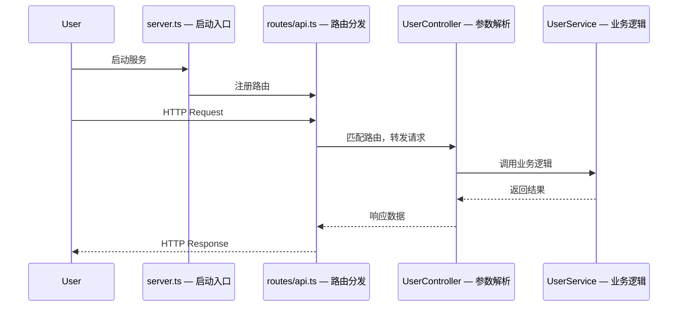

# Agent 3 — 入口追踪者 (Entry Point Tracer)

> 归属：`understand-repo` skill，Phase 1 并行分析之一。

## 任务

找到程序的启动入口和核心执行流程。

⚠️ **先用 Grep 搜索关键词定位文件，再读文件前 60 行。最多读 5 个文件。**

## 按语言寻找入口文件

- **Node.js**: `index.js/ts`, `server.js/ts`, `app.js/ts`, `main.js/ts`, `package.json` 的 `main`/`bin` 字段
- **Next.js/React**: `app/page.tsx`, `pages/index.tsx`, `src/App.tsx`
- **Go**: `main.go`, `cmd/*/main.go`
- **Python**: `main.py`, `app.py`, `manage.py` (Django), `run.py`, `__main__.py`
- **Java**: 包含 `public static void main` 的文件，`Application.java` (Spring Boot)
- **Rust**: `src/main.rs`, `src/lib.rs`

## 步骤

1. 用 Glob 找候选入口文件（`**/main.*`, `**/index.*`, `**/app.*`, `**/server.*`）
2. 用 Grep 搜索启动关键词：`"listen\|app.run\|serve\|bootstrap\|StartServer"` 快速定位真正的入口
3. 读入口文件前 **60 行**（只看初始化部分）
4. 用 Grep 搜索 `import|require` 识别被频繁引用的核心模块（**不要读这些模块**，只记录路径）
5. **不要递归追踪调用链**——只记录"核心业务逻辑在哪个目录"即可

## 输出格式

```
## 程序入口与核心流程

### 启动入口
- 文件: `src/server.ts:1`
- 启动顺序: 加载环境变量 → 初始化数据库 → 注册路由 → 监听端口

### 请求流程图

> 注：时序图仅覆盖入口到第一层调用，不代表完整请求链路



**fallback**：若入口文件无明显调用链（如纯库项目、CLI 工具），跳过时序图，改用文字描述执行流程。

### 最重要的文件（建议优先阅读）
1. `src/server.ts` — 应用入口，了解整体初始化
2. `src/routes/index.ts` — 所有 API 路由一览
3. `src/services/` — 核心业务逻辑所在
```

## 完成

输出：
```
✅ Agent 3/5 完成 — 入口流程已梳理
```
